# Sistema de Información de Notas y Asistencias para Colegios

Este proyecto tiene como objetivo desarrollar un **Sistema de Información de Notas y Asistencias** para colegios, que permita gestionar de manera eficiente la información académica de los estudiantes, incluyendo notas, asistencias, asignaturas, cursos y noticias escolares. El sistema está diseñado para ser utilizado por administradores, docentes, estudiantes y editores de noticias, cada uno con roles y permisos específicos.

---

## Requisitos del Sistema

### Requisitos Funcionales

1. **Gestión de Usuarios**:
   - Inicio y cierre de sesión para todos los usuarios.
   - Cambio de contraseña.
   - Creación, modificación y eliminación de usuarios por parte de los administradores.
   - Asignación de roles y permisos.
   - Registro de estudiantes a cursos y grupos.
   - Actualización de información personal por parte de docentes y estudiantes.
   - Consulta de información de estudiantes por parte de administradores y docentes.

2. **Gestión de Asignaturas y Cursos**:
   - Registro de asignaturas y asignación de docentes.
   - Consulta de asignaturas por curso para administradores, docentes y estudiantes.

3. **Gestión de Notas**:
   - Registro, edición y actualización de notas por parte de los docentes.
   - Consulta de notas según el rol del usuario.
   - Generación de reportes de notas por parte de administradores.

4. **Gestión de Asistencia**:
   - Registro, edición y actualización de asistencias por parte de los docentes.
   - Consulta de asistencias por parte de administradores, docentes y estudiantes.

5. **Gestión de Noticias Escolares**:
   - Publicación, edición y eliminación de noticias por parte del editor de noticias.
   - Consulta de noticias por parte de todos los usuarios.

---

### Requisitos de Comportamiento

1. **Reglas de Negocio**:
   - Un estudiante solo puede estar asignado a un único curso y grupo.
   - Un docente solo puede ingresar notas y asistencias para sus asignaturas asignadas.
   - Las notas no pueden ser modificadas después del cierre del período académico, salvo autorización del administrador.
   - Solo el administrador puede publicar, editar o eliminar noticias.
   - Un estudiante solo puede ver sus propias notas y asistencias.

2. **Validaciones y Restricciones**:
   - Las notas deben estar dentro del rango permitido (no negativas ni superiores al límite establecido).
   - Solo los administradores pueden generar reportes de notas.
   - Un estudiante solo puede tener un estado de asistencia por día y asignatura.
   - Las noticias solo pueden ser editadas o eliminadas por su autor.

---

## Casos de Uso

El sistema incluye los siguientes casos de uso:

1. **Gestión de Usuarios**:
   - UC-01: Iniciar sesión.

| **Especificación de caso de uso** | |
|-----------------------------------|-|
| **Nombre:**                       | Iniciar sesión |
| **Código:**                       | UC-01 |
| **Descripción:**                  | Permite a los usuarios iniciar sesión en el sistema con sus credenciales. |
| **Actores:**                      | Todos los usuarios |
| **Precondiciones:**               | El usuario debe estar registrado en el sistema. |
| **Flujo normal:**                 | 1. El usuario ingresa su nombre de usuario y contraseña. <br> 2. El sistema valida las credenciales. <br> 3. Si las credenciales son válidas, el sistema redirige al usuario a su página de inicio. |
| **Flujo Alternativo:**            | **Credenciales inválidas:** Si las credenciales son incorrectas, el sistema muestra un mensaje de error y solicita que se reintente. |
| **Poscondiciones:**               | El usuario ha iniciado sesión correctamente. |


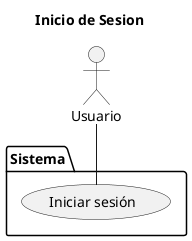

   - UC-02: Cerrar sesión.

| **Especificación de caso de uso** | |
|-----------------------------------|-|
| **Nombre:**                       | Cerrar sesión |
| **Código:**                       | UC-02 |
| **Descripción:**                  | Permite a los usuarios cerrar su sesión en el sistema. |
| **Actores:**                      | Todos los usuarios |
| **Precondiciones:**               | El usuario debe haber iniciado sesión. |
| **Flujo normal:**                 | 1. El usuario selecciona la opción "Cerrar sesión". <br> 2. El sistema cierra la sesión y redirige al usuario a la página de inicio de sesión. |
| **Flujo Alternativo:**            | Ninguno. |
| **Poscondiciones:**               | El usuario ha cerrado sesión correctamente. |


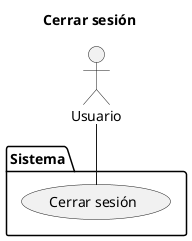

   - UC-03: Cambiar contraseña.

   | **Especificación de caso de uso** | |
|-----------------------------------|-|
| **Nombre:**                       | Cambiar contraseña |
| **Código:**                       | UC-03 |
| **Descripción:**                  | Permite a los usuarios cambiar su contraseña. |
| **Actores:**                      | Todos los usuarios |
| **Precondiciones:**               | El usuario debe haber iniciado sesión. |
| **Flujo normal:**                 | 1. El usuario selecciona la opción "Cambiar contraseña". <br> 2. El sistema solicita la contraseña actual y la nueva contraseña. <br> 3. El usuario ingresa los datos y confirma el cambio. <br> 4. El sistema actualiza la contraseña. |
| **Flujo Alternativo:**            | **Contraseña actual incorrecta:** Si la contraseña actual es incorrecta, el sistema muestra un mensaje de error. |
| **Poscondiciones:**               | La contraseña del usuario ha sido actualizada. |


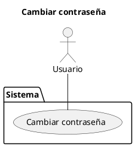

   - UC-04: Crear usuarios.

   | **Especificación de caso de uso** | |
|-----------------------------------|-|
| **Nombre:**                       | Crear usuarios |
| **Código:**                       | UC-04 |
| **Descripción:**                  | Permite al administrador crear nuevos usuarios en el sistema. |
| **Actores:**                      | Administrador |
| **Precondiciones:**               | El administrador debe haber iniciado sesión. |
| **Flujo normal:**                 | 1. El administrador selecciona "Crear usuario". <br> 2. El sistema solicita los datos del nuevo usuario (nombre, correo, rol, etc.). <br> 3. El administrador ingresa los datos y confirma la creación. <br> 4. El sistema registra al nuevo usuario. |
| **Flujo Alternativo:**            | **Datos inválidos:** Si los datos ingresados son inválidos, el sistema muestra un mensaje de error. |
| **Poscondiciones:**               | El nuevo usuario ha sido creado en el sistema. |


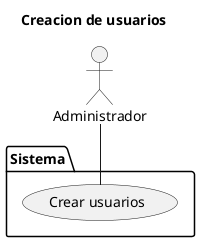

   - UC-05: Gestionar roles.

   | **Especificación de caso de uso** | |
|-----------------------------------|-|
| **Nombre:**                       | Gestionar roles |
| **Código:**                       | UC-05 |
| **Descripción:**                  | Permite al administrador asignar o modificar roles y permisos de usuarios. |
| **Actores:**                      | Administrador |
| **Precondiciones:**               | El administrador debe haber iniciado sesión. |
| **Flujo normal:**                 | 1. El administrador selecciona un usuario. <br> 2. El sistema muestra los roles disponibles. <br> 3. El administrador asigna o modifica el rol del usuario. <br> 4. El sistema actualiza los permisos del usuario. |
| **Flujo Alternativo:**            | **Rol no válido:** Si el rol seleccionado no es válido, el sistema muestra un mensaje de error. |
| **Poscondiciones:**               | Los roles y permisos del usuario han sido actualizados. |


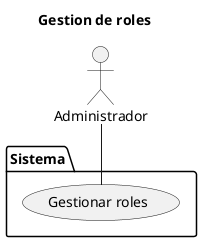

   - UC-06: Eliminar usuarios.

   | **Especificación de caso de uso** | |
|-----------------------------------|-|
| **Nombre:**                       | Eliminar usuarios |
| **Código:**                       | UC-06 |
| **Descripción:**                  | Permite al administrador eliminar usuarios del sistema. |
| **Actores:**                      | Administrador |
| **Precondiciones:**               | El administrador debe haber iniciado sesión. |
| **Flujo normal:**                 | 1. El administrador selecciona un usuario. <br> 2. El sistema solicita confirmación para eliminar al usuario. <br> 3. El administrador confirma la eliminación. <br> 4. El sistema elimina al usuario. |
| **Flujo Alternativo:**            | **Cancelar eliminación:** Si el administrador cancela la acción, el sistema no elimina al usuario. |
| **Poscondiciones:**               | El usuario ha sido eliminado del sistema. |


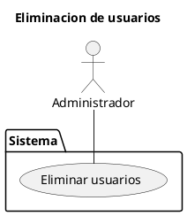

   - UC-07: Registrar estudiante a un curso.

   | **Especificación de caso de uso** | |
|-----------------------------------|-|
| **Nombre:**                       | Registrar estudiante a un curso |
| **Código:**                       | UC-07 |
| **Descripción:**                  | Permite al administrador asignar estudiantes a cursos específicos. |
| **Actores:**                      | Administrador |
| **Precondiciones:**               | El administrador debe haber iniciado sesión. |
| **Flujo normal:**                 | 1. El administrador selecciona un estudiante. <br> 2. El sistema muestra la lista de cursos disponibles. <br> 3. El administrador asigna al estudiante a un curso. <br> 4. El sistema registra la asignación. |
| **Flujo Alternativo:**            | **Curso no disponible:** Si no hay cursos disponibles, el sistema muestra un mensaje de error. |
| **Poscondiciones:**               | El estudiante ha sido asignado a un curso. |


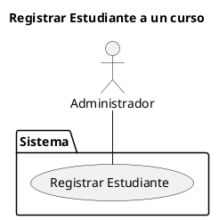

   - UC-08: Registrar estudiante a un grupo.

   | **Especificación de caso de uso** | |
|-----------------------------------|-|
| **Nombre:**                       | Registrar estudiante a un grupo |
| **Código:**                       | UC-08 |
| **Descripción:**                  | Permite al administrador asignar estudiantes a grupos específicos. |
| **Actores:**                      | Administrador |
| **Precondiciones:**               | El administrador debe haber iniciado sesión. |
| **Flujo normal:**                 | 1. El administrador selecciona un estudiante. <br> 2. El sistema muestra la lista de grupos disponibles. <br> 3. El administrador asigna al estudiante a un grupo. <br> 4. El sistema registra la asignación. |
| **Flujo Alternativo:**            | **Grupo no disponible:** Si no hay grupos disponibles, el sistema muestra un mensaje de error. |
| **Poscondiciones:**               | El estudiante ha sido asignado a un grupo. |


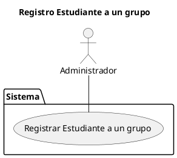

   - UC-09: Modificar información de estudiantes.

   | **Especificación de caso de uso** | |
|-----------------------------------|-|
| **Nombre:**                       | Modificar información de estudiantes |
| **Código:**                       | UC-09 |
| **Descripción:**                  | Permite al administrador actualizar la información de los estudiantes. |
| **Actores:**                      | Administrador |
| **Precondiciones:**               | El administrador debe haber iniciado sesión. |
| **Flujo normal:**                 | 1. El administrador selecciona un estudiante. <br> 2. El sistema muestra la información actual del estudiante. <br> 3. El administrador modifica la información y confirma los cambios. <br> 4. El sistema actualiza la información del estudiante. |
| **Flujo Alternativo:**            | **Datos inválidos:** Si los datos ingresados son inválidos, el sistema muestra un mensaje de error. |
| **Poscondiciones:**               | La información del estudiante ha sido actualizada. |


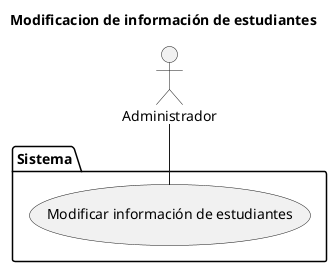

   - UC-10: Solicitar actualización de información.

   | **Especificación de caso de uso** | |
|-----------------------------------|-|
| **Nombre:**                       | Solicitar actualización de información |
| **Código:**                       | UC-10 |
| **Descripción:**                  | Permite a docentes y estudiantes solicitar cambios en su información personal. |
| **Actores:**                      | Docentes, Estudiantes |
| **Precondiciones:**               | El usuario debe haber iniciado sesión. |
| **Flujo normal:**                 | 1. El usuario selecciona "Solicitar actualización de información". <br> 2. El sistema muestra el formulario de solicitud. <br> 3. El usuario ingresa los cambios solicitados y envía la solicitud. <br> 4. El sistema registra la solicitud para su revisión. |
| **Flujo Alternativo:**            | **Datos inválidos:** Si los datos ingresados son inválidos, el sistema muestra un mensaje de error. |
| **Poscondiciones:**               | La solicitud de actualización ha sido enviada. |


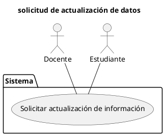

   - UC-11: Consultar información de estudiantes.

   | **Especificación de caso de uso** | |
|-----------------------------------|-|
| **Nombre:**                       | Consultar información de estudiantes |
| **Código:**                       | UC-11 |
| **Descripción:**                  | Permite a administradores y docentes consultar la información de los estudiantes. |
| **Actores:**                      | Administradores, Docentes |
| **Precondiciones:**               | El usuario debe haber iniciado sesión. |
| **Flujo normal:**                 | 1. El usuario selecciona "Consultar información de estudiantes". <br> 2. El sistema muestra la lista de estudiantes. <br> 3. El usuario selecciona un estudiante y consulta su información. |
| **Flujo Alternativo:**            | **Estudiante no encontrado:** Si el estudiante no existe, el sistema muestra un mensaje de error. |
| **Poscondiciones:**               | El usuario ha consultado la información del estudiante. |


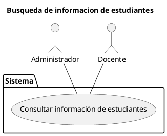


2. **Gestión de Asignaturas y Cursos**:
   - UC-12: Registrar asignaturas.

   | **Especificación de caso de uso** | |
|-----------------------------------|-|
| **Nombre:**                       | Registrar asignaturas |
| **Código:**                       | UC-12 |
| **Descripción:**                  | Permite al administrador registrar nuevas asignaturas en el sistema. |
| **Actores:**                      | Administrador |
| **Precondiciones:**               | El administrador debe haber iniciado sesión. |
| **Flujo normal:**                 | 1. El administrador selecciona "Registrar asignatura". <br> 2. El sistema solicita los datos de la asignatura (nombre, código, etc.). <br> 3. El administrador ingresa los datos y confirma el registro. <br> 4. El sistema registra la asignatura. |
| **Flujo Alternativo:**            | **Datos inválidos:** Si los datos ingresados son inválidos, el sistema muestra un mensaje de error. |
| **Poscondiciones:**               | La asignatura ha sido registrada en el sistema. |


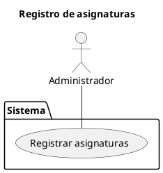

   - UC-13: Asignar docentes a asignaturas y grupos.

   | **Especificación de caso de uso** | |
|-----------------------------------|-|
| **Nombre:**                       | Asignar docentes a asignaturas y grupos |
| **Código:**                       | UC-13 |
| **Descripción:**                  | Permite al administrador asignar docentes a asignaturas y grupos específicos. |
| **Actores:**                      | Administrador |
| **Precondiciones:**               | El administrador debe haber iniciado sesión. |
| **Flujo normal:**                 | 1. El administrador selecciona una asignatura y un grupo. <br> 2. El sistema muestra la lista de docentes disponibles. <br> 3. El administrador asigna un docente a la asignatura y grupo. <br> 4. El sistema registra la asignación. |
| **Flujo Alternativo:**            | **Docente no disponible:** Si no hay docentes disponibles, el sistema muestra un mensaje de error. |
| **Poscondiciones:**               | El docente ha sido asignado a la asignatura y grupo. |


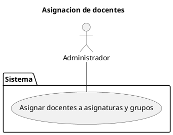
   - UC-14: Consultar asignaturas por curso.

   | **Especificación de caso de uso** | |
|-----------------------------------|-|
| **Nombre:**                       | Consultar asignaturas por curso |
| **Código:**                       | UC-14 |
| **Descripción:**                  | Permite a administradores, docentes y estudiantes consultar las asignaturas de un curso específico. |
| **Actores:**                      | Administradores, Docentes, Estudiantes |
| **Precondiciones:**               | El usuario debe haber iniciado sesión. |
| **Flujo normal:**                 | 1. El usuario selecciona "Consultar asignaturas por curso". <br> 2. El sistema muestra la lista de cursos. <br> 3. El usuario selecciona un curso y consulta las asignaturas asociadas. |
| **Flujo Alternativo:**            | **Curso no encontrado:** Si el curso no existe, el sistema muestra un mensaje de error. |
| **Poscondiciones:**               | El usuario ha consultado las asignaturas del curso. |


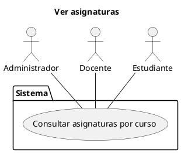

3. **Gestión de Notas**:
   - UC-15: Registrar notas de los estudiantes.

   | **Especificación de caso de uso** | |
|-----------------------------------|-|
| **Nombre:**                       | Registrar notas de los estudiantes |
| **Código:**                       | UC-15 |
| **Descripción:**                  | Permite a los docentes registrar las notas de los estudiantes. |
| **Actores:**                      | Docentes |
| **Precondiciones:**               | El docente debe haber iniciado sesión. |
| **Flujo normal:**                 | 1. El docente selecciona una asignatura y un grupo. <br> 2. El sistema muestra la lista de estudiantes. <br> 3. El docente ingresa las notas de cada estudiante y confirma el registro. <br> 4. El sistema registra las notas. |
| **Flujo Alternativo:**            | **Notas inválidas:** Si las notas ingresadas están fuera del rango permitido, el sistema muestra un mensaje de error. |
| **Poscondiciones:**               | Las notas de los estudiantes han sido registradas. |


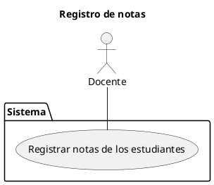

   - UC-16: Editar notas.

   | **Especificación de caso de uso** | |
|-----------------------------------|-|
| **Nombre:**                       | Editar notas |
| **Código:**                       | UC-16 |
| **Descripción:**                  | Permite a los docentes editar las notas de los estudiantes. |
| **Actores:**                      | Docentes |
| **Precondiciones:**               | El docente debe haber iniciado sesión. |
| **Flujo normal:**                 | 1. El docente selecciona una asignatura y un grupo. <br> 2. El sistema muestra la lista de estudiantes con sus notas. <br> 3. El docente modifica las notas y confirma los cambios. <br> 4. El sistema actualiza las notas. |
| **Flujo Alternativo:**            | **Notas inválidas:** Si las notas ingresadas están fuera del rango permitido, el sistema muestra un mensaje de error. |
| **Poscondiciones:**               | Las notas de los estudiantes han sido actualizadas. |


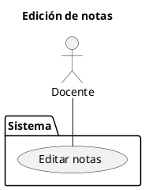

   - UC-17: Consultar notas.

   | **Especificación de caso de uso** | |
|-----------------------------------|-|
| **Nombre:**                       | Consultar notas |
| **Código:**                       | UC-17 |
| **Descripción:**                  | Permite a docentes y estudiantes consultar las notas de los estudiantes. |
| **Actores:**                      | Docentes, Estudiantes |
| **Precondiciones:**               | El usuario debe haber iniciado sesión. |
| **Flujo normal:**                 | 1. El usuario selecciona "Consultar notas". <br> 2. El sistema muestra las notas del estudiante o grupo seleccionado. |
| **Flujo Alternativo:**            | **Notas no disponibles:** Si no hay notas registradas, el sistema muestra un mensaje de error. |
| **Poscondiciones:**               | El usuario ha consultado las notas correctamente. |


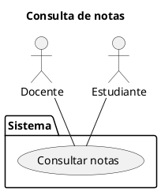
   - UC-18: Generar reportes de notas.

   | **Especificación de caso de uso** | |
|-----------------------------------|-|
| **Nombre:**                       | Generar reportes de notas |
| **Código:**                       | UC-18 |
| **Descripción:**                  | Permite a administradores y docentes generar reportes de notas de los estudiantes. |
| **Actores:**                      | Administradores, Docentes |
| **Precondiciones:**               | El usuario debe haber iniciado sesión. |
| **Flujo normal:**                 | 1. El usuario selecciona "Generar reporte de notas". <br> 2. El sistema solicita los parámetros del reporte (curso, grupo, período, etc.). <br> 3. El usuario ingresa los parámetros y confirma la generación. <br> 4. El sistema genera y muestra el reporte. |
| **Flujo Alternativo:**            | **Datos insuficientes:** Si no hay suficientes datos para generar el reporte, el sistema muestra un mensaje de error. |
| **Poscondiciones:**               | El reporte de notas ha sido generado y está disponible para su consulta. |


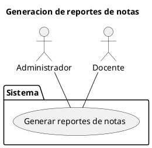

4. **Gestión de Asistencia**:
   - UC-19: Registrar asistencia de los estudiantes.

| **Especificación de caso de uso** | |
|-----------------------------------|-|
| **Nombre:**                       | Registrar asistencia de los estudiantes |
| **Código:**                       | UC-19 |
| **Descripción:**                  | Permite a los docentes registrar la asistencia de los estudiantes. |
| **Actores:**                      | Docentes |
| **Precondiciones:**               | El docente debe haber iniciado sesión. |
| **Flujo normal:**                 | 1. El docente selecciona una asignatura y un grupo. <br> 2. El sistema muestra la lista de estudiantes. <br> 3. El docente registra la asistencia de cada estudiante (presente, ausente, justificado). <br> 4. El sistema guarda los registros de asistencia. |
| **Flujo Alternativo:**            | **Asistencia ya registrada:** Si la asistencia ya fue registrada para esa fecha, el sistema muestra un mensaje de error. |
| **Poscondiciones:**               | La asistencia de los estudiantes ha sido registrada. |


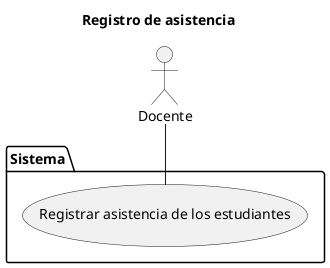
   - UC-20: Editar asistenciaS.

   | **Especificación de caso de uso** | |
|-----------------------------------|-|
| **Nombre:**                       | Editar asistencias |
| **Código:**                       | UC-20 |
| **Descripción:**                  | Permite a los docentes editar los registros de asistencia de los estudiantes. |
| **Actores:**                      | Docentes |
| **Precondiciones:**               | El docente debe haber iniciado sesión. |
| **Flujo normal:**                 | 1. El docente selecciona una asignatura y un grupo. <br> 2. El sistema muestra los registros de asistencia. <br> 3. El docente modifica los registros y confirma los cambios. <br> 4. El sistema actualiza los registros de asistencia. |
| **Flujo Alternativo:**            | **Registro no encontrado:** Si no hay registros de asistencia, el sistema muestra un mensaje de error. |
| **Poscondiciones:**               | Los registros de asistencia han sido actualizados. |


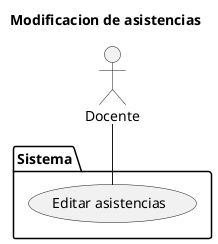

   - UC-21: Consultar asistencia.

   | **Especificación de caso de uso** | |
|-----------------------------------|-|
| **Nombre:**                       | Consultar asistencia |
| **Código:**                       | UC-21 |
| **Descripción:**                  | Permite a administradores, docentes y estudiantes consultar los registros de asistencia. |
| **Actores:**                      | Administradores, Docentes, Estudiantes |
| **Precondiciones:**               | El usuario debe haber iniciado sesión. |
| **Flujo normal:**                 | 1. El usuario selecciona "Consultar asistencia". <br> 2. El sistema muestra los registros de asistencia del estudiante o grupo seleccionado. |
| **Flujo Alternativo:**            | **Asistencia no disponible:** Si no hay registros de asistencia, el sistema muestra un mensaje de error. |
| **Poscondiciones:**               | El usuario ha consultado los registros de asistencia. |


```plantuml
@startuml
title Cosulta de asistencia
actor "Administrador" as Administrador
actor "Docente" as Docente
actor "Estudiante" as Estudiante

package Sistema{
usecase "Consultar asistencia" as UC21
Administrador -- UC21
Docente -- UC21
Estudiante -- UC21
}
@enduml
```

5. **Gestión de Noticias Escolares**:
   - UC-22: Publicar noticias del colegio.

| **Especificación de caso de uso** | |
|-----------------------------------|-|
| **Nombre:**                       | Publicar noticias del colegio |
| **Código:**                       | UC-22 |
| **Descripción:**                  | Permite al editor de noticias publicar noticias en la plataforma del colegio. |
| **Actores:**                      | Editor de Noticias |
| **Precondiciones:**               | El editor de noticias debe haber iniciado sesión. |
| **Flujo normal:**                 | 1. El editor selecciona "Publicar noticia". <br> 2. El sistema solicita el título, contenido y fecha de publicación. <br> 3. El editor ingresa los datos y confirma la publicación. <br> 4. El sistema publica la noticia. |
| **Flujo Alternativo:**            | **Datos incompletos:** Si faltan datos obligatorios, el sistema muestra un mensaje de error. |
| **Poscondiciones:**               | La noticia ha sido publicada y está disponible para todos los usuarios. |


```plantuml
@startuml
title Publicaion de noticias
actor "Editor de Noticias" as EditorNoticias

package Sistema{
usecase "Publicar noticias del colegio" as UC22
EditorNoticias -- UC22
}
@enduml
```
   - UC-23: Editar noticias.

   | **Especificación de caso de uso** | |
|-----------------------------------|-|
| **Nombre:**                       | Editar noticias |
| **Código:**                       | UC-23 |
| **Descripción:**                  | Permite al editor de noticias editar las noticias publicadas. |
| **Actores:**                      | Editor de Noticias |
| **Precondiciones:**               | El editor de noticias debe haber iniciado sesión. |
| **Flujo normal:**                 | 1. El editor selecciona una noticia publicada. <br> 2. El sistema muestra el contenido de la noticia. <br> 3. El editor modifica el contenido y confirma los cambios. <br> 4. El sistema actualiza la noticia. |
| **Flujo Alternativo:**            | **Noticia no encontrada:** Si la noticia no existe, el sistema muestra un mensaje de error. |
| **Poscondiciones:**               | La noticia ha sido actualizada. |


```plantuml
@startuml
title Edicion de noticias
actor "Editor de Noticias" as EditorNoticias

package Sistema{
usecase "Editar noticias" as UC23
EditorNoticias -- UC23
}
@enduml
```
   - UC-24: Eliminar noticias.

   | **Especificación de caso de uso** | |
|-----------------------------------|-|
| **Nombre:**                       | Eliminar noticias |
| **Código:**                       | UC-24 |
| **Descripción:**                  | Permite al editor de noticias eliminar noticias publicadas. |
| **Actores:**                      | Editor de Noticias |
| **Precondiciones:**               | El editor de noticias debe haber iniciado sesión. |
| **Flujo normal:**                 | 1. El editor selecciona una noticia publicada. <br> 2. El sistema solicita confirmación para eliminar la noticia. <br> 3. El editor confirma la eliminación. <br> 4. El sistema elimina la noticia. |
| **Flujo Alternativo:**            | **Cancelar eliminación:** Si el editor cancela la acción, el sistema no elimina la noticia. |
| **Poscondiciones:**               | La noticia ha sido eliminada del sistema. |


```plantuml
@startuml
title Eliminacion de noticias
actor "Editor de Noticias" as EditorNoticias

package Sistema{
usecase "Eliminar noticias" as UC24
EditorNoticias -- UC24
}
@enduml
```

---

## Modelo de Dominio

El modelo de dominio del sistema se representa mediante diagramas UML que describen las relaciones entre las entidades principales, como **Usuario**, **Administrador**, **Docente**, **Estudiante**, **Curso**, **Asignatura**, **Grupo**, **Nota**, **Asistencia**, **Noticia** y **Horario**.


```plantuml
@startuml
class Usuario {}
class ReporteNotas{}
class HistorialNotas{}
class HistorialAsistencias{}
class Administrador {}
class Docente {}
class Estudiante {}
class Curso {}
class Asignatura {}
class Grupo {}
class Nota {}
class Asistencia {}
class Noticia {}
class Horario{}

Usuario <|-- Administrador
Usuario <|-- Docente
Usuario <|-- Estudiante

Noticia --o Administrador
Noticia o-- Usuario

Grupo o-- Estudiante
Curso <|-- Grupo
Grupo o-- Horario
Horario o-- Asignatura
Asignatura o-- Docente
Asignatura o-- Nota


Nota o-- Estudiante
HistorialNotas o-- Nota

Administrador o-- Curso
Administrador o-- Usuario
Administrador o-- ReporteNotas

ReporteNotas o-- HistorialNotas
ReporteNotas o-- HistorialAsistencias

Docente o-- Asistencia
Asistencia o-- Estudiante
Estudiante o-- HistorialAsistencias
Asistencia --o HistorialAsistencias

@enduml
```

